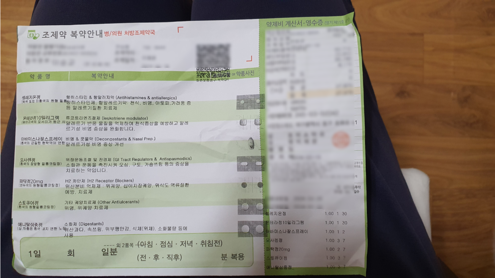

<p align="center">
  <a href="https://hdmedi.co.kr/">
    
  </a>
</p>

# HDMedi MedExtractor
> 일반 처방전과 약봉투 사진에서 약품명을 추출하고, 약국마다 다른 명칭이 사용되더라도 모두 식약처에 등록된 고유 약품명으로 매핑하도록 작성된 코드입니다.

<table style="width:100%; border-collapse:collapse; font-family:Arial, sans-serif; color:#333;">
  <tr style="background-color:#f9f9f9;">
    <th style="width:60%; padding:20px; text-align:center; border-bottom:2px solid #ddd;">Input</th>
    <th style="width:40%; padding:20px; text-align:center; border-bottom:2px solid #ddd;">Output</th>
  </tr>
  <tr>
    <td style="padding:20px; text-align:center; border-right:2px solid #ddd;">
      
    </td>
    <td style="padding:20px;">
      <ul style="list-style-type: disc; margin: 0; padding-left: 20px; font-size:16px; line-height:1.5;">
        <li>아바미스나잘스프레이 (미분화플루티카손푸로에이트)</li>
        <li>셀레지온정 (에피나스틴염산염)</li>
        <li>몬테라정 10밀리그램 (몬테루카스트나트륨)</li>
        <li>애니탈삼중정</li>
        <li>모사렌정 (모사프리드시트르산염수화물)</li>
        <li>파탁정 20mg (파모티딘)</li>
        <li>스토큐어정 (레바미피드)</li>
      </ul>
    </td>
  </tr>
</table>


## 1. Overview
### 1.1 Why HDMedi Extractor?
처방전이나 약봉투 사진에서 한글 약품명을 추출하기 위해선 두 가지 어려움이 있습니다.
- 첫 번째는 OCR을 통해 사진 데이터를 읽을 때, <b>어떤 텍스트가 약물명을 나타내고 있는지를 식별하기 어렵다는 점</b>입니다. 예를 들어, 학습 없이 '마이암부톨제피정이'라는 텍스트가 약품명이라는 걸 컴퓨터가 알 수 있을까요? 이는 한글 약품명에 특화된 NER(개체명 인식) 모델이 없기 때문에 발생하는 문제입니다.
- 두 번째는 <b>약국마다 동일한 약품에 대해 서로 다른 이름을 사용하기도 한다</b>는 점입니다. 이러한 문제를 해결하기 위해 통일성을 부여할 필요가 있습니다.
저희 팀은 이러한 문제점을 해결하고자 HDMedi Extractor를 기획·개발하였습니다.

### 1.2 주요 프로세스

- <b>Prescription/Medicine Bag Image Preprocessing</b>: 입력된 사진을 Naver OCR을 통해 텍스트로 변환합니다. 이 과정에서 텍스트가 여러 줄로 나뉘어질 수 있으므로, y값을 기준으로 각 줄을 하나의 문장으로 병합합니다.
- <b>Preprocessing and Unnecessary Line Removal</b>: OCR 처리된 텍스트 중에서 약물명이 포함되지 않은 것으로 보이는 줄을 제거하는 전처리 작업을 수행합니다. 이 단계에서는 약물명과 무관한 정보가 필터링됩니다.
- <b>Medicine Name Extraction and Alignment</b>: 자체 로직을 사용하여 실제 약품명 DB와 비교하여 텍스트에서 약물명을 추출합니다. 이 과정에서 약국마다 같은 약품을 다르게 명명할 수 있기 때문에, 서로 다른 약품명을 일치시키는 작업도 동시에 진행됩니다.

## 2. Requirements
### 2.1. 패키지 설치
이 프로젝트를 실행하기 위해서는 `RxBagExtractor`, `numpy`, `pandas` 패키지가 필요합니다. 이 패키지들은 다음 명령어로 설치할 수 있습니다.
```bash
pip install RxBagExtractor numpy pandas
```
RxBagExtractor는 저희 팀에서 자체 개발한 전처리용 파이썬 패키지입니다. 자세한 내용은 <a href="https://pypi.org/project/RxBagExtractor/">PyPI</a>에서 확인할 수 있습니다.

### 2.2 약품명 DB 구축
동일한 의약품이 약국마다 다른 명칭으로 사용되는 경우가 많아, 통일성을 위해 약품명 DB를 구축했습니다. 이 DB의 기준은 식품의약품안전처의 <a href="https://www.data.go.kr/data/15095677/openapi.do#/layer-api-guide">의약품 제품 허가정보</a>에 기재된 약품명을 따랐습니다.

| ITEM_SEQ | ITEM_NAME |
|-------------|----------------------------|
| 196400099 | 크로세린캡슐250밀리그램(시클로세린)(수출명 : Dong-A Cycloserine 250mg)          |
| 196700060  | 마이암부톨제피정400밀리그램(에탐부톨염산염)           |
| 197700211    | 브로드세프캡슐500밀리그램(세프라딘수화물)          |
| 197700212    | 브로드세프캡슐250밀리그램(세프라딘수화물)          |
| 197000014    | 중외염화나트륨주사액(117mg/1ml)          |

위와 같은 한글 약품명 컬럼을 전처리하여 약품 브랜드명에 대한 브랜드명, 단위, 초/중/종성 컬럼을 다음과 같이 추가하였습니다. 예를 들어, '크로세린캡슐250밀리그램(시클로세린)(수출명 : Dong-A Cycloserine 250mg)'에 대해선 '크로세린캡슐'에 대한 초/중/종성을 계산하는 것입니다.

| ITEM_SEQ    | ITEM_NAME                                                  | CHOSUNG     | JUNGSUNG   | JONGSUNG | Brand         | Unit         |
|-------------|------------------------------------------------------------|-------------|------------|----------|---------------|----------------|
| 196400099   | 크로세린캡슐250밀리그램(시클로세린)(수출명 : Dong-A Cycloserine 250mg) | ㅋㄹㅅㄹㅋㅅ | ㅡㅗㅔㅣㅐㅠ | ㄴㅂㄹ   | 크로세린캡슐        | 250밀리그램          |
| 196700060   | 마이암부톨제피정400밀리그램(에탐부톨염산염) |  ㅁㅇㅇㅂㅌㅈㅍㅈ   | ㅏㅣㅏㅜㅗㅔㅣㅓ |  ㅁㄹㅇ | 마이암부톨제피정에탐부톨염산염        | 400밀리그램        |
| 197700211   | 브로드세프캡슐500밀리그램(세프라딘수화물)     |   ㅂㄹㄷㅅㅍㅋㅅ  | ㅡㅗㅡㅔㅡㅐㅠ |   ㅂㄹ | 브로드세프캡슐        | 500밀리그램         |
| 197700212   | 브로드세프캡슐250밀리그램(세프라딘수화물)     |   ㅂㄹㄷㅅㅍㅋㅅ  | ㅡㅗㅡㅔㅡㅐㅠ |   ㅂㄹ | 브로드세프캡슐        | 250밀리그램        |
| 197000014   | 중외염화나트륨주사액(117mg/1ml)  |  ㅈㅇㅇㅎㄴㅌㄹㅈㅅㅇ |  ㅜㅚㅕㅘㅏㅡㅠㅜㅏㅐ  | ㅇㅁㅁㄱ  | 중외염화나트륨주사액        | 117밀리그램/1밀리리터      |

ITEM_NAME 컬럼 전처리에는 `preprocess_text` 함수를, ITEM_NAME_CHO, ITEM_NAME_JUNG, ITEM_NAME_JONG 컬럼을 위해서는 `extract_chojungsung` 함수를 정의하였습니다. 또한 Brand와 Unit 컬럼을 위해서 `extract_unit` 함수를 정의하였습니다. (주의: F1_Score을 쉽게 계산하기 위해 약품명 DB에서 하나의 약품명에 쉼표가 포함된 경우 이를 별개의 문자열로 수정하는 과정을 거쳤습니다.)

## 3. 함수 호출 순서

```plaintext
1. get_ocr_image_to_element(image_path)
   └──> 2. extractor(text) (from RxBagExtractor) - 텍스트 전처리 및 필터링

3. process_text(text)
   └──> 4. process_line(query)
   ├──> 5. preprocess_query(query)
   │ ├──> 6. extract_unit(query)
   │ │ └──> store_leftovers(match) (내부 함수로 호출됨)
   │ └──> 7. extract_chojungsung(c) (한글 자모 분해)
   ├──> 8. find_best_match(line, medication_db, query_unit)
   │ ├──> 9. generate_ngrams(text, n=3)
   │ ├──> 10. hangul_edit_distance(word1, word2)
   │ │ ├──> 11. phoneme_distance(a, b, phoneme_groups)
   │ │ │ └──> 12. get_phoneme_group(phoneme, phoneme_groups)
   │ └──> 6. extract_unit(med) (다시 호출)
   └──> 7. extract_chojungsung(c) (재사용)


```

`hangul_edit_distance` 함수는 <a href="https://www.dbpia.co.kr/journal/articleDetail?nodeId=NODE01567629">음소의 분류 체계를 이용한 한글 편집 거리 알고리즘 (노강호 외, 2010)</a>을 참고하여, 한글 음소의 분류 체계를 활용한 편집 거리 알고리즘을 구현한 것입니다. 이 알고리즘은 한글의 초성, 중성, 종성을 각각 비교하고, 음소 간의 유사성을 고려하여 편집 거리를 계산합니다.

본 문서에서는 이미지 처리를 위한 `get_ocr_image_to_element` 함수와 약품명 DB 전처리를 위한 `extractor` 함수의 로직에 대한 자세한 설명은 생략하겠습니다.


## 4. 주요 함수 설명
### 4.1 extract_unit(text)
> 오타가 포함된 텍스트에서 약물의 단위를 추출하는 역할을 하는 함수
- <i><b>Return: `Tuple` (result, leftovers) </b> 
  - result: `String` 표준화된 단위 문자열
  - leftovers: `List` 입력된 텍스트 중 단위로 인식된 문자열의 리스트

- <b>Explanation</b>
  - 먼저, `store_leftovers`라는 내부 함수를 통해 텍스트 내 단위와 관련된 패턴을 찾고, 이를 표준화된 단위로 변환합니다. 밀리그램, 밀리리터, %, 그리고 정과 같은 단위가 해당합니다.
  - 또한, 입력된 텍스트 중 단위로 인식된 문자열을 함께 저장합니다.

- <b> Example </b></i>
```python
extract_unit('린 텔력스정20밀리그끔')
# Result: ('20밀리그램', ['밀리그끔'])
extract_unit('중외염화나트륨주사액(117mg/1ml)')
# Result: ('117밀리그램/1밀리리터', ['mg', 'ml'])
```

### 4.2 generate_ngrams(text, n=3)
> 입력 텍스트를 n-gram 방식으로 분할하여, n개의 연속된 문자를 포함하는 서브스트링 리스트를 생성하는 함수
사용 예: generate_ngrams('가나다라', 2) → ['가나', '나다', '다라']

- <i><b> Return: `List` ngram_list </b>
  - ngram_list: `List` 텍스트의 서브스트링 리스트
- <b>Explanation</b>
  - 기본으로 n=3으로 서브스트링을 생성합니다.
  - n-gram을 사용하는 이유: n-gram 비교를 통해 오타나 철자 변형에 더 잘 대응하기 위함입니다. 예를 들어, "타이레놀"과 "타이레널"은 한 글자 차이지만, n-gram 비교에서는 상당히 유사한 것으로 평가될 수 있습니다. 이를 통해 ocr 특성상 오타가 많이 포함된 텍스트에서도 일관된 결과를 얻고자 하였습니다.
- <b> Example </b></i>
```python
generate_ngrams('브린텔릭스정20밀리그램')
# Result: ['브린텔', '린텔릭', '텔릭스', '릭스정', '스정2', '정20', '20밀', '0밀리', '밀리그', '리그램']
```

### 4.3 phoneme_distance(a, b, phoneme_groups)
> 음소(초성, 중성, 종성)의 그룹을 고려하여 두 음소 간 거리를 계산하는 함수

- <i><b> Return: `Integer` dist </b>
  - dist: `Integer` 두 음소간 거리
- <b>Explanation</b>
  - `get_phoneme_group` 함수를 이용하여 두 음소가 같은 그룹에 있는지 다른 그룹에 있는지를 확인한 뒤, 이를 기반으로 두 음소간 편집 거리를 계산합니다.
  - 두 음소가 같으면 1점, 두 음소가 다르지만 같은 그룹에 있으면 -3점, 두 음소가 다르고 다른 그룹에 있으면 -2점을 부여합니다. 이 값들은 모두 조정 가능한 매개변수입니다.
  - phoneme_groups에는 코드에서 미리 정의된 CHOSEONG_GROUPS, JUNGSEONG_GROUPS, JONGSEONG_GROUPS 중 하나를 입력합니다.
- <b> Example </b></i>
```python
# CHOSEONG_GROUPS includes ["ㄱ", "ㄲ", "ㅋ"] and ["ㄴ"].
phoneme_distance('ㄱ', 'ㄱ', CHOSEONG_GROUPS)
# Result: 1
phoneme_distance('ㄱ', 'ㅋ', CHOSEONG_GROUPS)
# Result: -3
phoneme_distance('ㄱ', 'ㄴ', CHOSEONG_GROUPS)
# Result: -2
```

### 4.4 hangul_edit_distance(word1, word2)
> phoneme_distance 함수를 기반으로 두 단어간 유사도 대한 점수를 계산하는 함수

- <i><b> Return: `Integer` dist </b>
  - dist: `Integer` 두 단어간 거리
- <b>Explanation</b>
  - 한글을 제외한 영어, 숫자 등의 문자열은 무시하고 거리를 계산합니다.
  - edit_distance가 반환되는 것이 아니라 유사도에 대한 점수가 반환 됩니다. 따라서 점수가 높을수록 두 문자열이 더 유사하다고 해석할 수 있습니다.
- <b> Example </b></i>
```python
hangul_edit_distance('가나', '카나')
# Result: -2
hangul_edit_distance('린 텔력스정20밀리그끔', '브린텔릭스정20밀리그램')
# Result: 2
hangul_edit_distance('브린텔릭스정20밀리그램', '브린텔릭스정20밀리그램')
# Result: 24
```

### 4.5 find_best_match(line, medication_db, query_unit, threshold=4)
> 주어진 텍스트와 데이터베이스에서 가장 유사한 약물명을 찾습니다. hangul_edit_distance 함수를 이용하여 편집거리를 계산하기 전에 약품명 DB에서 후보군을 필터링하는 작업을 진행합니다. 총 4개의 케이스가 있고, 각 케이스에 따라 처리 방식이 조금씩 달라집니다.

- <i><b> Return: `Tuple` (med_match,best_score)  </b>
  - med_match: `String` 약품명DB에서 입력 텍스트(line)과 가장 유사한 약품명
  - best_score: `Integer` med_match와 line 간의 유사도
- <b>Explanation</b>
  - `medication_db`(약품명DB에서 ITEM_NAME 컬럼에 대한 리스트)를 순회하며 generate_ngrams 함수를 통해 얻은 line의 n-gram substring과의 hangul_edit_distance 점수를 계산합니다. 가장 높은 점수가 나올 때마다 `best_score`를 업데이트하고 해당 점수가 나온 약물명을 `best_matches` 리스트에 저장합니다.
  - CASE 분기처리: 분기는 아래와 같은 순서로 
  |CASE | COND. |내용|
  |------|---|---|
  |1| (best_score < 0) and (!best_matches)  | best_matches 리스트가 존재하지 않거나 best_score의 값이 threshold 값보다 작은 경우 None이 반환됩니다.
  |2| CASE 1 조건 불만족|best_matches 리스트 중에서 line의 unit과 동일한 unit을 가지는 element가 있으면 이를 반환합니다.|
  |3|CASE 2 조건 불만족|best_matches 리스트 중 첫 번째 값을 가져온 뒤, 단위와 관련된 스트링을 모두 삭제합니다. 그런 뒤 약품명 DB에서 이와 같은 'brand' 값을 가지는 rows를 필터링합니다. 이 중에서 line의 unit과 동일한 unit을 갖는 row가 있다면 이를 반환합니다.|
  |4|CASE 3 조건 불만족|best_matches 리스트 중 첫 번째 값을 반환합니다.|
  ---
</i>

### 4.6 process_line(query)
> find_best_match 함수를 호출하기 전에 사용하는 함수입니다. 입력된 line을 정리하고, 탐색 시간을 줄이기 위해 mecation_db를 일부 필터링하여 find_best_match 함수로 전달합니다.

- <i><b> Return: Call `find_best_match`  </b>
- <b>Explanation</b>
  - `medication_db`(약품명DB에서 ITEM_NAME 컬럼에 대한 리스트)를 필터링하고 입력된 line을 전처리하여 find_best_match 함수에 전달합니다.
  - 필터링 기준: `levenshtein` 함수를 이용하여 전처리한 line의 초성과 약품명_DB의 ITEM_CHO 컬럼에서 각 row마다 편집 거리를 계산하여 가까운 순으로 상위 30개의 rows를 우선 필터링합니다. 그런 뒤에 `levenshtein` 함수를 다시 이용하여 전처리한 line의 중성과 약품명_DB의 ITEM_JUNG 컬럼에서 각 row마다 편집 거리를 계산하여 가까운 순으로 상위 20개를 필터링합니다.

- <b> Example </b></i>
```python
process_line('668000!20 린 텔력스정20밀리그끔')
# Result: ('브린텔릭스정20밀리그램(보티옥세틴브롬화수소산염)', 6.0)
```

### 4.7 process_text(text)
> process_line 함수를 통해 다수의 텍스트 라인을 처리하여 각 라인별로 매칭된 약물명을 반환합니다. 전체 프로세스를 묶어 한 번에 실행하는 함수입니다.

- <i><b> Return: `List` matched_med_list  </b>
  - matched_med_list: `List` 코드를 통해 인식된 약품명 최종 목록

- <b> Example </b></i>
```python
example = """668000!20 린 텔력스정20밀리그끔
卨1905230 레피졸정2밀리그컵
640006660 사일 레노정3밀리그"""
process_text(example)
# Result: ['브린텔릭스정20밀리그램(보티옥세틴브롬화수소산염)', '레피졸정2밀리그램(아리피프라졸)', '사일레노정3밀리그램(독세핀염산염)']
# Processing time: 3.1908891201019287 seconds
```

# 5. Performance

약 60개의 약봉투 데이터에 대하여 해당 코드를 돌린 결과 아래와 같은 결과가 나왔습니다.
- Overall Precision: 0.655
- Overall Recall: 0.728
- Overall F1 Score: 0.690